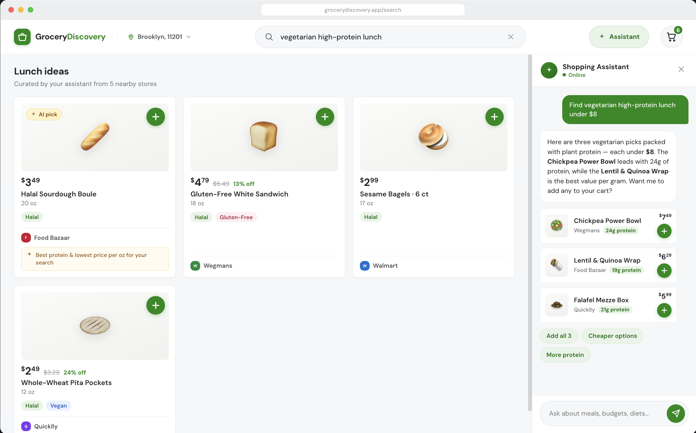
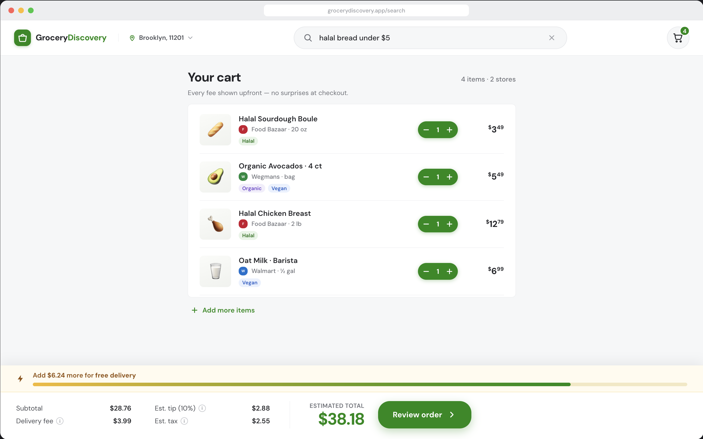
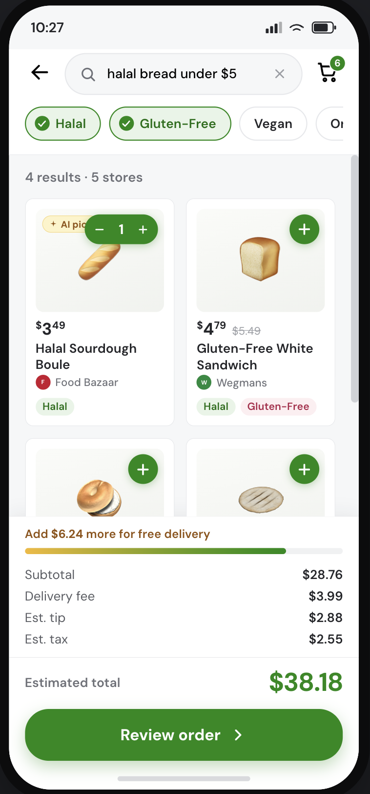
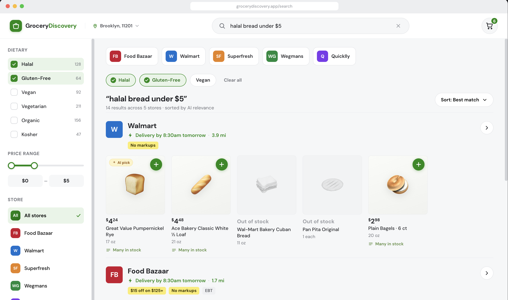

# AI-Assisted Grocery Discovery
**UX Research → Findings → Figma Redesign → Working Prototype → Interactive AI Demo**

> A usability study of 8 Instacart shoppers revealed that the platform creates barriers for users with dietary, cultural, and budget constraints. This repo documents the research — and the working product I built from its findings.

| | |
|---|---|
| **Research** | CS663 — Human Factors & Usability Metrics, Pace University (team) |
| **Engineering** | Personal extension — solo, post-course |
| **Research team** | Anel Bazarbayeva, Ashiyah, Andrew, Younes |
| **Stack** | Python · FastAPI · scikit-learn · React 18 · Vite · Claude API |

---
## 🎥 Interactive Concept Preview

This 30-second prototype demonstrates the intended AI-assisted grocery discovery experience.

📹 Concept Preview Video:
[screenshots/ai-assistant-concept-preview.mov](screenshots/ai-assistant-concept-preview.mov)

## Two Parts to This Project

### Part 1 — The Research (Team, Pace University)

A moderated usability study conducted with 8 participants across 40–50 minute Zoom sessions. Think-aloud protocol. Task 3 deliberately restricted search to expose browsing behavior that the platform's reliance on search normally hides.

**Course:** CS663 — Human Factors & Usability Metrics  
**Deliverables:** Usability plan, session facilitation, thematic analysis, design recommendations, final presentation

→ [`research/FINDINGS.md`](research/FINDINGS.md) — all 8 findings with participant quotes and evidence  
→ [`research/METHODOLOGY.md`](research/METHODOLOGY.md) — recruitment, session plan, analysis approach  
→ [`research/Instacart_Usability_Study_Final.pdf`](research/Instacart_Usability_Study_Final.pdf) — final presentation deck  
→ [`research/Instacart_Usability_Study_Draft.pdf`](research/Instacart_Usability_Study_Draft.pdf) — working draft

### Part 2 — The Engineering Extension (Solo, Anel Bazarbayeva)

After the course ended, I built a working prototype to implement what the research recommended. Every feature maps directly to a finding.

| Research finding | What I built |
|---|---|
| Filters failed users | Dietary filter system — halal, vegan, gluten-free, stackable |
| Budget opacity | Budget estimator — subtotal + delivery fee + tip + tax per store |
| Cultural food gaps | Catalog with halal, West African, and specialty items |
| Card information missing | Product cards with dietary tags and store visible by default |
| Search dependency | Natural-language product search using TF-IDF similarity |
| Platform wasn't built for everyone | AI chatbot aware of dietary needs and cultural food queries |

This engineering extension was completed independently after the course concluded.

---

## What Was Built

### Backend — FastAPI + scikit-learn
- **`api/search.py`** — Natural-language product search using TF-IDF similarity with cosine ranking. Accepts queries like "halal meals under $10" and returns ranked results
- **`api/budget.py`** — Real cost estimation with per-store delivery fee structures, free delivery thresholds, tip and tax calculation. Directly addresses the research finding that item price alone is misleading
- **`api/main.py`** — 4 REST endpoints, CORS enabled, fully documented via FastAPI's `/docs`
- **16 tests passing** — search accuracy, filter logic, budget math

### Frontend — React 18 + Vite
- Product grid with real-time search → filter → results pulled from the API
- Sidebar: dietary filter pills, price range slider, store selector, AI Picks toggle
- Budget bar — live cost breakdown appears as items are added to cart
- **AI chatbot** — * AI chat interface — supports an optional Claude-powered experience when an Anthropic API key is configured

---

## Key Research Findings

**8/8 users chose a familiar store before the page finished loading.** Store selection happened in their heads, not on the screen.

**0 users found a price filter.** 3 gave up on dietary filters. Only 1 store had a gluten-free option.

**Most users never opened a product detail page.** The card is the product page — but halal badges, gluten-free labels, and nutritional info weren't on it.

**One participant searched for Ghanaian butter bread across three stores.** No results. Accepted Hawaiian rolls as a substitute. Planned a separate in-person trip. This isn't an edge case — it's a design gap.

**Users evaluate budget as total delivered cost.** Item price without fees, tip, and tax is misleading. One participant questioned whether items were truly under budget before adding them.

---

## Prototype Status

This is a working research-driven prototype, not a production Instacart integration. The backend search, filters, product catalog, and budget estimation are functional. The Claude-powered chat requires an Anthropic API key. Future improvements include stronger embeddings, deployed hosting, expanded product data, and AI-generated match explanations.

---

---

## Screenshots & Concept Preview

### AI-Assisted Grocery Discovery

<p align="center">
  
</p>

This concept shows how users can ask natural-language grocery questions and receive product recommendations grounded in dietary, cultural, and budget needs.

### Budget Transparency

<p align="center">
  
</p>

### Mobile Discovery Experience

<p align="center">
  
</p> 

### Prototype Overview

<p align="center">
  
</p>


---

## Project Structure

```
instacart-discovery/
├── api/
│   ├── main.py          # FastAPI app — 4 endpoints
│   ├── search.py        # TF-IDF search engine
│   └── budget.py        # Cost estimation with per-store fee logic
│
├── data/
│   ├── products.json    # 20-product catalog across 4 stores
│   └── build_index.py   # Builds search index
│
├── frontend/
│   ├── src/
│   │   ├── App.jsx
│   │   └── components/
│   │       ├── Header.jsx
│   │       ├── Sidebar.jsx
│   │       ├── ProductGrid.jsx
│   │       ├── BudgetBar.jsx
│   │       └── ChatBot.jsx
│   └── package.json
│
├── research/
│   ├── FINDINGS.md
│   ├── METHODOLOGY.md
│   ├── Instacart_Usability_Study_Final.pdf
│   └── Instacart_Usability_Study_Draft.pdf
│
├── screenshots/
│   ├── ai-assistant-desktop.png
│   ├── budget-transparency-desktop.png
│   ├── mobile-discovery.png
│   ├── prototype-overview.png
│   └── ai-assistant-concept-preview.mov
│
├── tests/
│   └── test_api.py      # 16 tests
│
├── requirements.txt
├── render.yaml
└── README.md
```

---

## Quick Start

### Backend
```bash
pip install -r requirements.txt
python data/build_index.py
uvicorn api.main:app --reload
# API docs: http://localhost:8000/docs
```

### Frontend
```bash
cd frontend
npm install
npm run dev
# Runs at http://localhost:5173
# Proxies /api → http://localhost:8000
```

### AI Chatbot setup
```bash
# frontend/.env.local
VITE_API_URL=                              # leave blank for local dev
VITE_ANTHROPIC_API_KEY=your_api_key_here  # get from console.anthropic.com
```
Claude-powered chat is available when an Anthropic API key is configured. Without it, all other features — search, filters, budget — work fully. For production, proxy the API call through your backend to keep the key server-side.

### Tests
```bash
pytest tests/ -v
```

---

## API Endpoints

| Method | Endpoint | Description |
|---|---|---|
| GET | `/health` | Liveness check |
| GET | `/products` | Full catalog |
| GET | `/products/search` | TF-IDF search + dietary / store / price filters |
| POST | `/budget` | Full cost estimate with per-store fee structure |

**Search example:**
```
GET /products/search?q=halal+chicken&dietary=halal&max_price=10
```

**Budget example:**
```json
POST /budget
{
  "items": [{"price": 6.99, "quantity": 1}, {"price": 8.49, "quantity": 2}],
  "store": "ShopRite"
}
```

---

## Deploy to Render (free tier)

1. Push this repo to GitHub
2. [render.com](https://render.com) → New Web Service → connect repo
3. Render reads `render.yaml` automatically → Deploy
4. Set `VITE_API_URL` in `frontend/.env.local` to your live Render URL

---

## Upgrade Path

To use full semantic embeddings in production:
```bash
pip install sentence-transformers
```
Replace `TfidfVectorizer` in `data/build_index.py` with `SentenceTransformer("all-MiniLM-L6-v2")`. Everything else stays the same.

---

*Research conducted at Pace University, CS663 — Human Factors & Usability Metrics, Spring 2026.  
Engineering extension by Anel Bazarbayeva — independent, post-course.  
Not affiliated with Instacart.*
